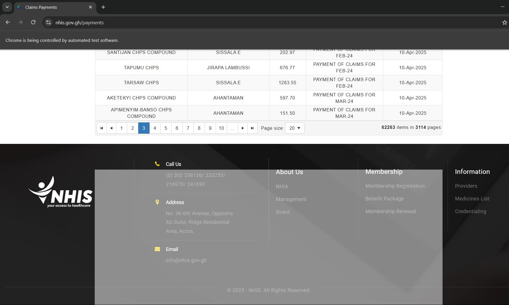

# NHIS Payments Scraper

[](https://www.python.org/) [](LICENSE) [](https://github.com/yourusername/nhis-payments-scraper/actions) [](https://codecov.io/gh/yourusername/nhis-payments-scraper)

A robust, fault-tolerant **web scraper** built with Selenium and Pandas to extract payment records from the NHIS Ghana payments portal. Designed for resumable scraping, configurable delays, and clean data output.

---

## 📋 Table of Contents

- [Features](#-features)
- [Demo](#-demo)
- [Prerequisites](#-prerequisites)
- [Installation](#-installation)
- [Usage](#-usage)
- [Configuration](#-configuration)
- [Directory Structure](#-directory-structure)
- [Output](#-output)
- [Customization](#-customization)
- [Contributing](#-contributing)
- [License](#-license)
- [Contact](#-contact)

---

## 🔑 Features

- **Complete Data Extraction**  
  Scrapes all records:
  - Facility Name  
  - District  
  - Amount Paid  
  - Claim Month  
  - Payment Date  

- **Resumable & Incremental**  
  Checkpoints progress to resume after interruptions.

- **Configurable Delays & Timeouts**  
  Prevents server overload; adapts to dynamic page loads.

- **Data Validation & Cleaning**  
  Filters out incomplete or blank rows before saving.

- **Extensible & Maintainable**  
  Modular design; easy to extend for additional columns or logic.

---

## 🎬 Demo



```bash
$ python scraper.py
[INFO] Starting scrape at page 1
[INFO] Scraped page 1: 50 records
...
[INFO] Completed. 1200 records saved to nhis_payments_all.csv
```

---

## ⚙️ Prerequisites

- **Python** ≥ 3.6  
- **Google Chrome**  
- **ChromeDriver** matching your Chrome browser version  
- Python libraries:
  - `selenium`
  - `pandas`
  - `pytest` (for tests, optional)

---

## 🛠️ Installation

1. **Clone the repo**  
   ```bash
   git clone https://github.com/yourusername/nhis-payments-scraper.git
   cd nhis-payments-scraper
   ```

2. **Install dependencies**  
   ```bash
   pip install -r requirements.txt
   ```

3. **Verify ChromeDriver**  
   Ensure `chromedriver` is in your `$PATH` or set `CHROMEDRIVER_PATH` environment variable.

---

## 🚀 Usage

Run with default settings:
```bash
python scraper.py
```

View help for advanced options:
```bash
python scraper.py --help
```

Command-line arguments:

| Option                | Description                                  | Default                |
|-----------------------|----------------------------------------------|------------------------|
| `--url`               | Target URL to scrape                         | `https://www.nhis.gov.gh/payments` |
| `--timeout`           | Element wait timeout (seconds)               | `15`                   |
| `--delay`             | Delay between page requests (seconds)        | `0.5`                  |
| `--output`            | CSV output filename                          | `nhis_payments_all.csv`|
| `--checkpoint-file`   | Checkpoint filename                          | `nhis_checkpoint.txt`  |
| `--headless`          | Run browser in headless mode                 | `False`                |

---

## 🗂️ Directory Structure

```
nhis-payments-scraper/
├── scraper.py
├── requirements.txt
├── demo/
│   └── screenshot.png
├── tests/
│   └── test_scraper.py
├── LICENSE
└── README.md
```

---

## 📂 Output

- **nhis_payments_all.csv**: Consolidated payment records.  
- **nhis_checkpoint.txt**: Last scraped page checkpoint (auto-deleted on success).

Sample CSV snippet:

| Facility Name        | District       | Amount Paid | Claim Month | Payment Date |
|----------------------|----------------|-------------|-------------|--------------|
| Korle Bu Hospital    | Greater Accra  | GHS 5,000   | Jan 2025    | 2025-02-10   |
| Tamale Teaching Hosp | Northern       | GHS 3,200   | Feb 2025    | 2025-03-15   |

---

## ✨ Customization

- Adjust delays and timeouts via CLI flags or environment variables.  
- Extend `HEADERS` in `scraper.py` to capture additional columns.

---

## 🤝 Contributing

1. Fork the repository  
2. Create a feature branch (`git checkout -b feature/xyz`)  
3. Commit changes (`git commit -m 'Add new feature'`)  
4. Push branch (`git push origin feature/xyz`)  
5. Open a Pull Request  

Please follow our [Code of Conduct](CODE_OF_CONDUCT.md).

---

## 📄 License

This project is licensed under the **MIT License**. See [LICENSE](LICENSE) for details.

---

## 📬 Contact

**Lanor Jephthah Kwame**  
- Email: mclanorjeff@gmail.com  
- LinkedIn: https://www.linkedin.com/in/lanor-jephthah-kwame  
- GitHub: https://github.com/yourusername  
